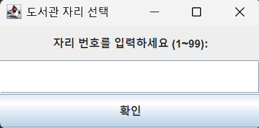
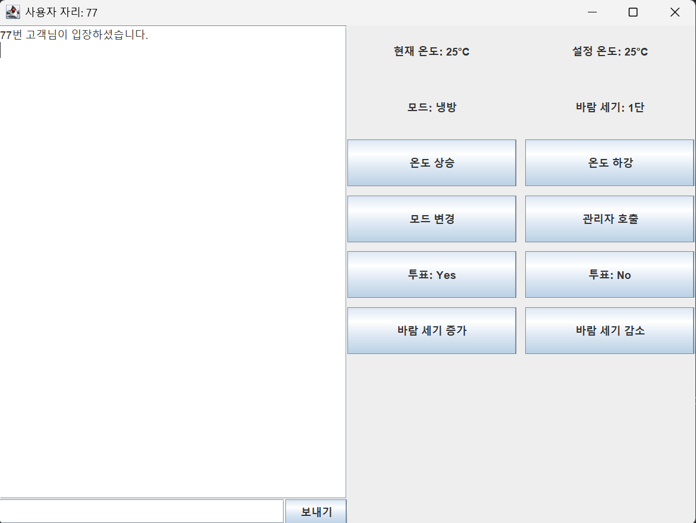

# 🌬️ AirYouReady? - 도서관 에어컨 중앙 컨트롤러 ❄️🔥  

**"도서관 에어컨 온도 조절, 이제 더 이상 눈치 보지 마세요!"** 🏫  
**"공정하고, 편리하게! 실시간 중앙 에어컨 컨트롤 시스템"** 🎛️  

---

# ✨ 프로젝트 소개

안녕하세요! 😆 `AirYouReady`는 도서관이나 스터디룸에서 에어컨을 공정하게 제어할 수 있는 **실시간 에어컨 중앙 제어 시스템**입니다!  
이 시스템은 각 자리마다 **에어컨 제어 기능**을 제공하여 사용자들이 서로 눈치 보지 않고 온도와 모드를 조정할 수 있도록 도와줍니다. 📊❄️

🤔 "너무 더워서 온도를 내리고 싶어!"  
😨 "근데 다른 사람이 추워하면 어떡하지?"  
💡 **이제 걱정 NO!** 모두의 의견을 반영하는 시스템이 여기 있습니다!  

📡 **실시간 투표 기능**과 **중앙 서버 컨트롤**로, **공정한 에어컨 설정**을 실현하세요!  

---

# 🌟 주요 기능  

## 🎮 **1. 사용자 기능**  
✅ **온도 조절** - 원하는 온도로 변경 요청 가능!  
✅ **투표 시스템** - 다수결 투표로 공정한 온도 설정!  
✅ **모드 변경** - 냉방 / 난방 모드 전환 가능 (관리자 설정)  
✅ **실시간 채팅** - 조용한 도서관에서도 소음 없이 의견 나누기!  
✅ **바람 세기 조절** - 1~3단계로 자유롭게 바람 강도 조절  

## 🛠️ **2. 관리자 기능**  
🔹 **공지 전송** - 관리자 메시지를 모든 사용자에게 전송 가능!  
🔹 **투표 방식 변경** - "다수결" 또는 "평균 온도" 모드 설정  
🔹 **온도 강제 조정** - 관리자 직접 온도 설정 가능!  
🔹 **계절 모드 설정** - 여름(냉방) / 겨울(난방) 제한 기능  
🔹 **사용자 관리** - 특정 자리에서 관리자 호출 기능 제공  

## 🔄 **3. 실시간 UI 반영**  
💬 **사용자의 요청이 즉시 반영**되고, 모든 참가자가 **실시간으로 확인** 가능!  
👀 **깔끔한 GUI** (Java `JFrame` 기반) 로 누구나 쉽게 사용 가능!  

---

# 🛠️ 기술 스택  

🚀 **백엔드**  
🔹 `Java` - 멀티스레딩과 소켓 프로그래밍 활용!  
🔹 `Socket API` - 실시간 통신을 위한 네트워크 프로그래밍  
🔹 `멀티스레딩 (Thread)` - 여러 사용자 동시 접속 지원  
🔹 `파일 입출력 (I/O)` - 로그 저장 및 데이터 관리  

🎨 **프론트엔드 (GUI)**  
🔹 `Java Swing (JFrame)` - 직관적인 UI 구성  
🔹 `AWT & SwingUtilities` - UI 업데이트 및 이벤트 처리  

💾 **데이터 관리 & 로직**  
🔹 `객체지향 프로그래밍 (OOP)` - 유지보수 용이한 구조 설계  
🔹 `VoteManager` - 실시간 투표 기능 구현  
🔹 `AirConditionerManager` - 온도 및 모드 변경 로직 담당  

---

# 😊 예시 사진 😊

---

# 🏗️ 프로젝트 구조  

📂 Term_Project_AirYouReady
  📂 src
    📂 client # 클라이언트 기능 구현 
    MainClientUI.java
    ClientManager.java
    ACControlPanel.java
    ChatPanel.java
    LibrarySeatSelector.java
    📂 server # 서버 기능 구현
    Server.java
    ServerMain.java
    ClientHandler.java
    AirConditionerManager.java
    VoteManager.java
    README.md

---

# 🔧 실행 방법

1. Server를 먼저 실행합니다.
2. Client를 실행합니다.
3. 자리 번호를 입력한 후 사용을 시작하세요!

---

# 🛠 기술적 도전과 해결
- 다수결 모드: 투표 시스템을 구현하여 공정한 의사 결정을 지원! (30초 내 찬반 투표)
- 실시간 데이터 처리: 클라이언트와 서버 간 실시간으로 데이터가 동기화되어 에어컨 상태를 실시간으로 반영!
- 서버 안정성: 멀티스레딩을 사용하여 동시에 많은 사용자가 접속할 수 있도록 구현했어요! 🚀

---

# 🎉 기대 효과

💡 공정한 온도 조절 시스템 - 다수결 & 평균 모드로 편리하게!

💡 실시간 투표 시스템 - 대화 없이 투표로 온도 결정!

💡 소음 없는 의견 교환 - 채팅 기능으로 도서관 정숙 유지!

💡 편리한 관리자 기능 - 공지, 모드 변경, 강제 설정 기능 탑재!

📢 "도서관에서도 눈치 없이 편하게! AirYouReady가 해결합니다!" 🌬️🔥

---

# 📢 Contact & Contribute

💌 개발자 : 김동우

🔗 GitHub : flydongwoo

📧 Email: rlaehddn1019@naver.com

🛠️ 프로젝트 개선 제안 및 PR 환영! 🙌
